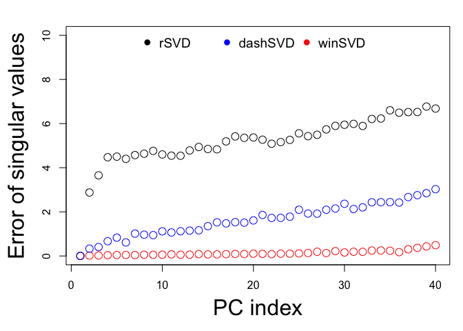

<!-- README.md is generated from README.Rmd. Please edit that file -->

# Fast and accurate randomized singular value decomposition (RSVD)

## Introduction

There are 3 versions of RSVD implemented in this package, which are
ordered by their accuracy.

  - **winSVD**: [window based randomized singular value
    decomposition](https://genome.cshlp.org/content/33/9/1599)
  - **dashSVD**: [randomized singular value decomposition with dynamic
    shifted eigenvalues](https://dl.acm.org/doi/10.1145/3660629)
  - **sSVD**: [single pass randomized singular value decomposition with
    power iterations](https://genome.cshlp.org/content/33/9/1599)

<!-- badges: start -->

<!-- badges: end -->

## Installation


``` r
# install.packages("pcaone") # For the CRAN version
remotes::install_github("Zilong-Li/PCAoneR") # For the latest developing version
```

## Example

This is a basic example which shows you how to use pcaone:

``` r
library(pcaone)
mat <- matrix(rnorm(100*5000), 5000, 100)
res <- pcaone(mat, k = 10)
str(res)
#> List of 3
#>  $ d: num [1:10] 80 79.5 79.1 79 78.6 ...
#>  $ u: num [1:5000, 1:10] -0.0187 0.01282 0.00819 0.01606 0.00111 ...
#>  $ v: num [1:100, 1:10] -0.0925 -0.0236 -0.1496 -0.0353 0.0525 ...
#>  - attr(*, "class")= chr "pcaone"
```

## Benchmarking of accuracy

We define the accuracy as the error of singular values using results of
`RSpectra::svds` as truth. For all RSVD, let’s restrict the number of
epochs as 7, i.e. how many times the whole matrix is read through if it
can only be hold on disk.

``` r
library(RSpectra) ## svds
library(rsvd)     ## regular rsvd
library(pcaone)
data(popgen)
A <- popgen - rowMeans(popgen) ## center
k <- 40
system.time(s0 <- RSpectra::svds(A, k = k) )
#>    user  system elapsed 
#>  29.327   6.687   1.528
system.time(s1 <- rsvd::rsvd(A, k = k, q = 4))  ## the number of epochs is 4*2=8
#>    user  system elapsed 
#>  10.674  22.568   1.955
system.time(s2 <- pcaone(A, k = k, method = "ssvd"))
#>    user  system elapsed 
#>   6.961   3.461   0.437
system.time(s3 <- pcaone(A, k = k, method = "winsvd"))
#>    user  system elapsed 
#>   9.868   9.518   0.957
system.time(s4 <- pcaone(A, k = k, method = "dashsvd"))
#>    user  system elapsed 
#>  11.842  14.117   2.280

par(mar = c(5, 5, 2, 1))
plot(s0$d-s1$d, ylim = c(0, 10), xlab = "PC index", ylab = "Error of singular values", cex = 1.5, cex.lab = 2)
points(s0$d-s2$d, col = "orange", cex = 1.5)
points(s0$d-s3$d, col = "red", cex = 1.5)
points(s0$d-s4$d, col = "blue", cex = 1.5)
legend("top", legend = c("rSVD", "sSVD", "winSVD", "dashSVD"), pch = 16,col = c("black", "orange", "red", "blue"), horiz = T, cex = 1.2, bty = "n" )
```



Now let’s see how many epochs we need for `rSVD`, `sSVD` and `dashSVD`
to reach the accuracy of `winSVD`.

``` r
system.time(s1 <- rsvd::rsvd(A, k = k, q = 20))  ## the number of epochs is 4*20=40
#>    user  system elapsed 
#>  34.556  53.571   4.203
system.time(s2 <- pcaone(A, k = k, method = "ssvd", p = 20))
#>    user  system elapsed 
#>  15.759   5.670   0.899
system.time(s4 <- pcaone(A, k = k, method = "dashsvd", p = 20))
#>    user  system elapsed 
#>  31.030  40.201   4.903

par(mar = c(5, 5, 2, 1))
plot(s0$d-s1$d, ylim = c(0, 2), xlab = "PC index", ylab = "Error of singular values", cex = 1.5, cex.lab = 2)
points(s0$d-s2$d, col = "orange", cex = 1.5)
points(s0$d-s3$d, col = "red", cex = 1.5)
points(s0$d-s4$d, col = "blue", cex = 1.5)
legend("top", legend = c("rSVD", "sSVD", "winSVD", "dashSVD"), pch = 16,col = c("black", "orange", "red", "blue"), horiz = T, cex = 1.2, bty = "n" )
```


## Benchmarking of speed

Let’s see the performance of `pcaone` compared to the other packages.

``` r
library(microbenchmark)
timing <- microbenchmark(
  'RSpectra' = svds(A,k = k),
  'rSVD' = rsvd(A, k=k, q = 20),
  'pcaone.winsvd' = pcaone(A, k=k, p = 7),
  'pcaone.ssvd' = pcaone(A, k=k, p = 20, method = "ssvd"),
  'pcaone.dashsvd' = pcaone(A, k=k, p = 20, method = "dashsvd"),
  times=5)
print(timing, unit='s')
#> Unit: seconds
#>            expr       min        lq     mean   median       uq      max neval
#>        RSpectra 1.3405160 1.4557409 1.624167 1.506560 1.537043 2.280976     5
#>            rSVD 3.7770404 4.2052743 5.405628 5.400490 6.323018 7.322318     5
#>   pcaone.winsvd 0.8201352 0.9213472 1.425965 1.631140 1.742322 2.014879     5
#>     pcaone.ssvd 0.8309767 0.9813462 1.788951 2.087639 2.398111 2.646681     5
#>  pcaone.dashsvd 5.1641422 5.2611238 5.499963 5.598988 5.629761 5.845800     5
```

## References

  - [Zilong Li, Jonas Meisner, Anders Albrechtsen (2023). Fast and
    accurate out-of-core PCA framework for large scale biobank
    data](https://genome.cshlp.org/content/33/9/1599)
  - [Feng et al. 2024. Algorithm 1043: Faster Randomized SVD with
    Dynamic Shifts](https://dl.acm.org/doi/10.1145/3660629)

## Todo

  - [ ] add `center` and `scale` method
