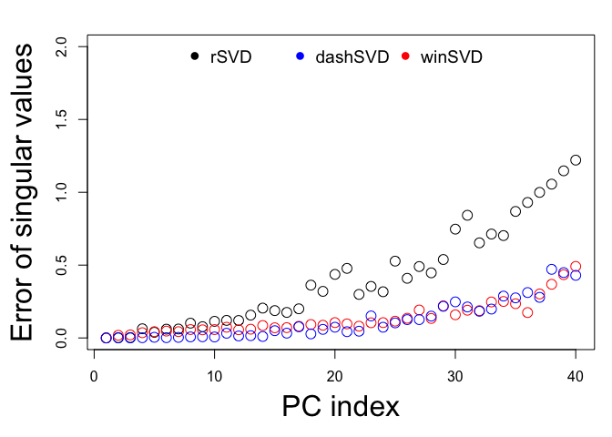

<!-- README.md is generated from README.Rmd. Please edit that file -->

# Fast and accurate randomized singular value decomposition (RSVD)

## Introduction

There are 3 versions of RSVD implemented in this package, which are
ordered by their accuracy.

  - **winSVD**: [window based randomized singular value
    decomposition](https://genome.cshlp.org/content/33/9/1599)
  - **dashSVD**: [randomized singular value decomposition with dynamic
    shifted eigenvalues](https://dl.acm.org/doi/10.1145/3660629)
  - **sSVD**: [single pass randomized singular value decomposition with
    power iterations](https://genome.cshlp.org/content/33/9/1599)

<!-- badges: start -->

<!-- badges: end -->

## Installation

``` r
# install.packages("pcaone") # For the CRAN version
remotes::install_github("Zilong-Li/PCAoneR") # For the latest developing version
```

## Example

This is a basic example which shows you how to use pcaone:

``` r
library(pcaone)
mat <- matrix(rnorm(100*5000), 5000, 100)
res <- pcaone(mat, k = 10)
str(res)
#> List of 3
#>  $ d: num [1:10] 80.3 79.7 79.6 79.3 78.7 ...
#>  $ u: num [1:5000, 1:10] 0.00914 0.01157 0.01647 -0.01457 0.00449 ...
#>  $ v: num [1:100, 1:10] 0.00383 0.07312 -0.02572 0.05766 0.10849 ...
#>  - attr(*, "class")= chr "pcaone"
```

## Benchmarking of accuracy

We define the accuracy as the error of singular values using results of
`RSpectra::svds` as truth. For all RSVD, let’s restrict the number of
epochs as 8 with only `winsvd` using 7, i.e. how many times the whole
matrix is read through if it can only be hold on disk.

``` r
library(RSpectra) ## svds
library(rsvd)     ## regular rsvd
library(pcaone)
data(popgen)
A <- popgen - rowMeans(popgen) ## center
k <- 40
system.time(s0 <- RSpectra::svds(A, k = k) )
#>    user  system elapsed 
#>  29.306  12.016   1.804
system.time(s1 <- rsvd::rsvd(A, k = k, q = 4))  ## the number of epochs is two times of power iters, 4*2=8
#>    user  system elapsed 
#>  10.440  28.235   2.752
system.time(s2 <- pcaone(A, k = k, method = "ssvd", p = 8))
#>    user  system elapsed 
#>   8.265   9.720   0.785
system.time(s3 <- pcaone(A, k = k, method = "winsvd", p = 7))
#>    user  system elapsed 
#>   9.882  11.067   1.036
system.time(s4 <- pcaone(A, k = k, method = "dashsvd", p = 6)) ## the number of epochs is 2 + power iters
#>    user  system elapsed 
#>   6.185   5.101   0.521

par(mar = c(5, 5, 2, 1))
plot(s0$d-s1$d, ylim = c(0, 10), xlab = "PC index", ylab = "Error of singular values", cex = 1.5, cex.lab = 2)
points(s0$d-s2$d, col = "orange", cex = 1.5)
points(s0$d-s3$d, col = "red", cex = 1.5)
points(s0$d-s4$d, col = "blue", cex = 1.5)
legend("top", legend = c("rSVD", "sSVD", "dashSVD", "winSVD"), pch = 16,col = c("black", "orange", "blue", "red"), horiz = T, cex = 1.2, bty = "n" )
```


Now let’s see how many epochs we need for `rSVD`, `sSVD` and `dashSVD`
to reach the accuracy of `winSVD`.

``` r
system.time(s1 <- rsvd::rsvd(A, k = k, q = 20))  ## the number of epochs is 4*20=40
#>    user  system elapsed 
#>  34.971  57.354   4.448
system.time(s2 <- pcaone(A, k = k, method = "ssvd", p = 20))
#>    user  system elapsed 
#>  17.254  21.050   2.406
system.time(s4 <- pcaone(A, k = k, method = "dashsvd", p = 18))
#>    user  system elapsed 
#>  14.644  13.760   1.446

par(mar = c(5, 5, 2, 1))
plot(s0$d-s1$d, ylim = c(0, 2), xlab = "PC index", ylab = "Error of singular values", cex = 1.5, cex.lab = 2)
points(s0$d-s2$d, col = "orange", cex = 1.5)
points(s0$d-s3$d, col = "red", cex = 1.5)
points(s0$d-s4$d, col = "blue", cex = 1.5)
legend("top", legend = c("rSVD", "sSVD", "dashSVD", "winSVD"), pch = 16,col = c("black", "orange", "blue", "red"), horiz = T, cex = 1.2, bty = "n" )
```



## Benchmarking of speed

Let’s see the performance of `pcaone` compared to the other packages.

``` r
library(microbenchmark)
timing <- microbenchmark(
  'RSpectra' = svds(A,k = k),
  'rSVD' = rsvd(A, k=k, q = 20),
  'pcaone.winsvd' = pcaone(A, k=k, p = 7),
  'pcaone.ssvd' = pcaone(A, k=k, p = 20, method = "ssvd"),
  'pcaone.dashsvd' = pcaone(A, k=k, p = 18, method = "dashsvd"),
  times=10)
print(timing, unit='s')
#> Unit: seconds
#>            expr       min        lq     mean    median       uq      max neval
#>        RSpectra 1.6214804 1.8045701 2.153150 2.1708929 2.378451 2.792410    10
#>            rSVD 3.9832089 4.4928445 5.597502 5.7184078 6.678621 7.167970    10
#>   pcaone.winsvd 0.8413689 1.2609646 1.542842 1.4258020 1.786600 2.211722    10
#>     pcaone.ssvd 1.0405265 1.1062428 1.507835 1.2116182 1.897299 2.432535    10
#>  pcaone.dashsvd 0.7261568 0.7517289 1.275557 0.9464012 1.349643 2.672243    10
```

## References

  - [Zilong Li, Jonas Meisner, Anders Albrechtsen (2023). Fast and
    accurate out-of-core PCA framework for large scale biobank
    data](https://genome.cshlp.org/content/33/9/1599)
  - [Feng et al. 2024. Algorithm 1043: Faster Randomized SVD with
    Dynamic Shifts](https://dl.acm.org/doi/10.1145/3660629)

## Todo

  - [ ] add `center` and `scale` method
